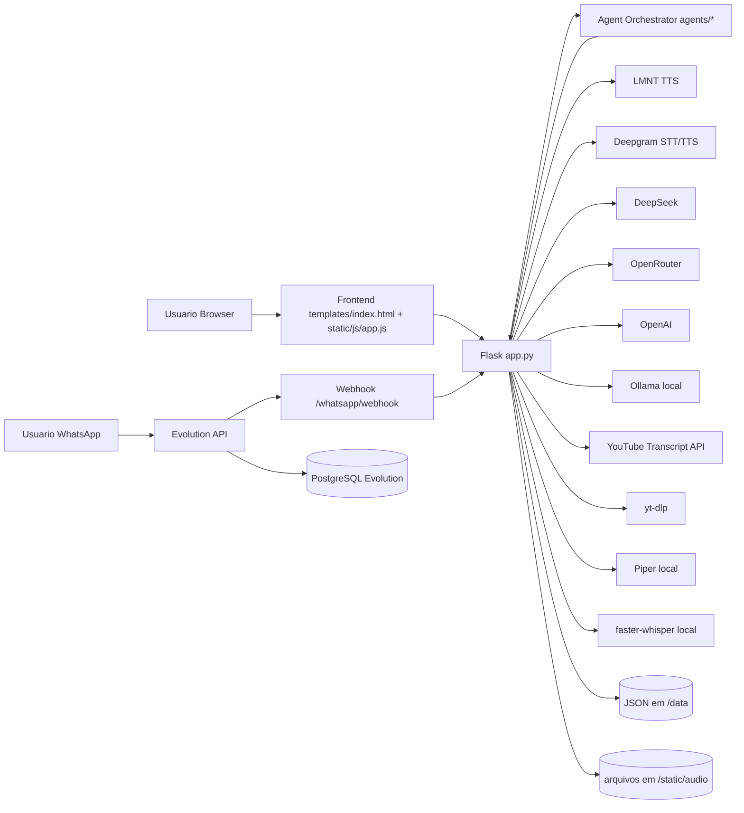
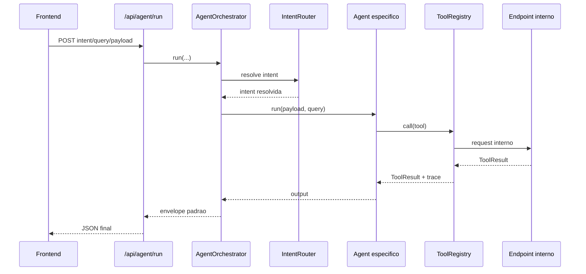

# Shadowing Practice for Fluency
## Documentacao completa: sistema, arquitetura, agentes e tecnologias

Ultima atualizacao: 2026-03-04

---

## 1. Objetivo do sistema

O projeto **Shadowing Practice for Fluency** e uma plataforma de pratica de idiomas com foco em fluencia oral.

Ela combina:

- geracao de audio para shadowing (TTS)
- analise de texto com IA
- conversa por voz com IA
- laboratorio de karaoke com YouTube
- registro de progresso
- modulo de mini-aulas por WhatsApp (integrado a Evolution API)
- camada de orquestracao por agentes para padronizar chamadas entre features

---

## 2. Visao geral de arquitetura

A aplicacao e um backend Flask monolitico (`app.py`) com frontend server-side (HTML + JS + CSS) e modulos de dominio em pacotes separados (`agents/`, `whatsapp/`).

### 2.1 Diagrama de contexto (alto nivel)



### 2.2 Topologia Docker do projeto

`docker-compose.yml` sobe 3 servicos principais:

- `shadowing-practice`: Flask + Gunicorn
- `evolution-api`: gateway WhatsApp
- `evolution-db`: PostgreSQL do Evolution

Volumes:

- `./config:/app/config:ro`
- `./data:/app/data`
- `./models:/app/models:ro`
- `./static/audio:/app/static/audio`
- `evolution_instances`
- `evolution_db`

---

## 3. Stack tecnologica

## 3.1 Backend

- Python 3.12
- Flask 3
- Gunicorn
- Requests
- python-dotenv
- APScheduler

## 3.2 IA / Audio / NLP

- Piper TTS (local/offline)
- faster-whisper (STT local)
- LMNT (TTS cloud)
- Deepgram (STT/TTS cloud)
- DeepSeek (chat)
- OpenRouter (chat e audio em fallback de transcript)
- OpenAI (chat e transcricao em rotas especificas)
- Ollama (fallback local de texto)

## 3.3 YouTube

- youtube-search
- youtube-transcript-api
- yt-dlp

## 3.4 Frontend

- HTML server-rendered (`templates/index.html`)
- JS puro (`static/js/app.js`)
- CSS puro (`static/css/style.css`)

## 3.5 WhatsApp

- Evolution API (Baileys)
- PostgreSQL (estado da Evolution)

---

## 4. Estrutura de pastas (nucleo)

```text
.
|-- app.py
|-- agents/
|   |-- contracts.py
|   |-- router.py
|   |-- orchestrator.py
|   |-- practice_agent.py
|   |-- conversation_agent.py
|   |-- youtube_agent.py
|   |-- progress_agent.py
|-- whatsapp/
|   |-- evolution_client.py
|   |-- handler.py
|   |-- scheduler.py
|   |-- student_manager.py
|   |-- lesson_curriculum.py
|-- templates/
|   |-- index.html
|-- static/
|   |-- js/app.js
|   |-- css/style.css
|   |-- audio/
|-- data/
|   |-- progress.json
|   |-- session_history.json
|   |-- whatsapp_students.json
|-- Dockerfile
|-- docker-compose.yml
|-- setup-whatsapp.sh
|-- requirements.txt
```

---

## 5. Modulos funcionais da interface

A UI principal (tabs) esta em `templates/index.html`:

- `Praticar`
- `IA Tools`
- `Conversar`
- `Progresso`

Dentro de `IA Tools` existe a area administrativa do modulo WhatsApp:

- status
- setup de instancia
- QR Code
- lista de alunos

---

## 6. Arquitetura do backend (`app.py`)

`app.py` concentra:

- configuracao e leitura de `.env`
- helpers de validacao/sanitizacao de payload
- integracoes externas (IA/TTS/STT/YouTube)
- regras de fallback
- rotas HTTP
- inicializacao lazy do modulo WhatsApp
- orquestrador de agentes

### 6.1 Persistencia

- `data/progress.json`: log de estudo
- `data/session_history.json`: historico de sessoes geradas
- `data/whatsapp_students.json`: estado dos alunos WhatsApp
- `static/audio/`: audios gerados (sessao, frase, conversa, gravacoes)

### 6.2 Confiabilidade

- escrita atomica em JSON (`_write_json_atomic`)
- lock global `_DATA_LOCK` para historico/progresso
- cleanup de audio por idade/quantidade (`_cleanup_old_audio`)
- tratamento de erro para API (`400`, `404`, `405`, `413`, `500`)

---

## 7. Arquitetura de agentes (`agents/`)

O subsistema de agentes desacopla intencao de negocio da rota concreta.

## 7.1 Componentes

### `contracts.py`

Define contratos-base:

- `ToolResult`: envelope padrao de tool call
- `TraceEvent`: trilha de execucao (latencia, status, etapa)
- `AgentContext`: `trace_id`, `trace`, `warnings`, `errors`
- `ToolRegistry`: registro e chamada de tools
- `BaseAgent`: helper para executar tool com telemetria de trace

### `router.py`

`IntentRouter` resolve intent (`auto`, `practice`, `conversation`, `youtube`, `progress`) por:

1. intent explicita
2. chaves no payload
3. palavras-chave da query
4. fallback final para `practice`

### `orchestrator.py`

`AgentOrchestrator`:

- resolve intent via router
- escolhe agente correspondente
- executa agente
- retorna envelope unico com:
  - `ok`, `trace_id`
  - intent solicitada e resolvida
  - agente escolhido
  - resultado
  - erros, warnings e trace detalhado

### Agentes de dominio

- `PracticeAgent`: sessao, analise, geracao de texto
- `ConversationAgent`: turno de voz e aula da conversa
- `YoutubeAgent`: transcript e estudo frase-a-frase
- `ProgressAgent`: salvar e resumir progresso

## 7.2 Registro das tools no backend

Em `app.py`, `_build_agent_tool_registry()` registra tools que chamam rotas internas via `app.test_client()`:

- `generate_session` -> `POST /api/generate`
- `analyze_text` -> `POST /api/analyze`
- `generate_practice_text` -> `POST /api/generate-practice`
- `youtube_transcript` -> `POST /api/youtube-transcript`
- `youtube_transcript_study` -> `POST /api/youtube-transcript-study`
- `conversation_turn` -> `POST /api/conversation`
- `conversation_lesson` -> `POST /api/conversation/lesson`
- `progress_get` -> `GET /api/progress`
- `progress_save` -> `POST /api/progress`
- `history_get` -> `GET /api/history`
- `status_get` -> `GET /api/status`
- `audio_stats` -> `GET /api/audio-stats`
- `cleanup_audio` -> `POST /api/cleanup`

## 7.3 Fluxo do orquestrador



## 7.4 Fallback no frontend para agentes

`static/js/app.js` usa `runAgentWithFallback()`:

- tenta `/api/agent/run`
- se falhar, chama endpoint direto de feature (ex.: `/api/generate`)

Isso evita quebra da UI quando o orquestrador falha.

---

## 8. Fluxos de produto

## 8.1 Praticar (`POST /api/generate`)

Passos:

1. valida texto e idioma
2. decide engine TTS solicitada (`lmnt`, `deepgram`, `local`)
3. gera audio com fallback entre cloud e local (Piper)
4. busca videos relacionados no YouTube
5. segmenta em sentencas
6. retorna pacote de sessao (audio + texto + videos + metadata)

## 8.2 TTS de frase (`POST /api/tts`)

Semelhante ao fluxo acima, mas focado em uma frase unica.

## 8.3 Analise de texto (`POST /api/analyze`)

- monta prompt estruturado
- usa `chat_with_fallback`
- extrai JSON da resposta da IA
- normaliza e filtra campos para manter consistencia
- se IA indisponivel: analise local basica

## 8.4 Gerador de pratica (`POST /api/generate-practice`)

- recebe tema, nivel, foco, idioma, tamanho e tipo
- gera texto com IA em formato JSON
- aplica saneamento e reforco de tamanho
- fallback local se provedores indisponiveis

## 8.5 YouTube Karaoke (`POST /api/youtube-transcript`)

Extracao por modo de sincronizacao:

- `accuracy`: prioriza audio/STT
- `balanced`: mistura API de legenda e STT
- `fast`: prioriza legendas

Fontes de transcript usadas conforme disponibilidade:

- YouTube Transcript API
- Deepgram STT
- yt-dlp
- Local Whisper
- OpenRouter audio
- OpenAI audio

## 8.6 YouTube Study (`POST /api/youtube-transcript-study`)

- recebe transcript do cliente ou extrai do video
- seleciona frases relevantes
- gera traducao/pronuncia/explicacao
- complementa lacunas com IA/fallback local

## 8.7 Conversacao por voz (`POST /api/conversation`)

Pipeline:

1. recebe `audio_b64`
2. transcreve com **Whisper local** (obrigatorio nessa rota)
3. gera resposta textual com IA (ou fallback local)
4. gera audio de resposta via TTS com fallback
5. opcionalmente gera "colinha" de respostas

## 8.8 Aula da conversa (`POST /api/conversation/lesson`)

- analisa historico de chat
- foca em `balanced`, `corrections` ou `vocabulary` (ou `smart`)
- retorna:
  - transcript com traducao
  - resumo, vocabulario, gramatica, correcoes
  - feedback de pronuncia estimado
  - sugestoes de resposta

## 8.9 Progresso

- `GET /api/progress`: lista entradas
- `POST /api/progress`: salva entrada
- `DELETE /api/progress/<index>`: remove
- `GET /api/progress/export`: exporta CSV

## 8.10 Historico

- `GET /api/history`
- `POST /api/history`

## 8.11 Utilitarios

- `GET /api/audio-stats`
- `POST /api/cleanup`
- `GET /api/status`

---

## 9. Modulo WhatsApp (`whatsapp/`)

## 9.1 Componentes

### `evolution_client.py`

Cliente HTTP da Evolution API:

- cria instancia
- configura webhook
- consulta status
- obtem QR Code
- envia texto/audio/reacao
- baixa midia em base64
- converte WAV -> OGG/Opus quando necessario

### `student_manager.py`

Gerencia alunos com persistencia em `data/whatsapp_students.json`:

- CRUD basico
- ativacao/desativacao
- avanco de licao e streak
- estatisticas de interacao
- lock interno para thread-safety

### `lesson_curriculum.py`

Curriculo de mini-aulas por idioma/nivel com campos:

- frase
- traducao
- IPA
- contexto
- dica
- exemplo

### `scheduler.py`

Agendamento automatico com APScheduler:

- envios diarios (9h e 19h, America/Sao_Paulo)
- envio imediato (`send_now`)
- entrega texto + audio (Piper) da licao

### `handler.py`

Processa eventos de webhook:

- onboarding (nivel)
- comandos (`INICIAR`, `PROXIMA`, `REPETIR`, `AJUDA`, `PARAR`, `NIVEL`, `PROGRESSO`, `VOZ ON/OFF`)
- mensagem de audio (feedback de pronuncia)
- mensagem de texto livre (chat IA)

## 9.2 Integracao WhatsApp no `app.py`

Inicializacao lazy em `_get_wa_handler()` injeta:

- `ai_feedback_fn` (feedback de pronuncia)
- `ai_chat_fn` (chat livre)
- `ai_tts_fn` (TTS IA para resposta de voz)

## 9.3 STT/TTS no WhatsApp

### TTS de resposta

`_wa_ai_tts_audio_b64()`:

- le `WHATSAPP_TTS_ENGINE` (`auto`, `deepgram`, `lmnt`, `piper`)
- tenta Deepgram/LMNT conforme modo
- converte audio para OGG base64
- fallback final em `handler._send_voice_message()` para Piper local

### STT para feedback de audio

`_wa_transcribe_audio_file()` tenta:

1. OpenAI Whisper (se chave)
2. Deepgram STT
3. Local Whisper

## 9.4 Rotas administrativas do modulo WhatsApp

- `GET/POST /whatsapp/webhook`
- `POST /whatsapp/webhook/<event_suffix>`
- `GET /whatsapp/status`
- `GET /whatsapp/qrcode`
- `POST /whatsapp/setup`
- `POST /whatsapp/send`
- `GET /whatsapp/students`

---

## 10. Catalogo de endpoints

## 10.1 Paginas

- `GET /`
- `GET /favicon.ico`

## 10.2 API principal

- `GET /api/voices`
- `POST /api/generate`
- `POST /api/tts`
- `POST /api/analyze`
- `POST /api/generate-practice`
- `POST /api/videos`
- `POST /api/youtube-transcript`
- `POST /api/youtube-transcript-study`
- `GET /api/progress`
- `POST /api/progress`
- `DELETE /api/progress/<index>`
- `GET /api/progress/export`
- `GET /api/history`
- `POST /api/history`
- `GET /api/audio-stats`
- `POST /api/cleanup`
- `POST /api/conversation`
- `POST /api/conversation/lesson`
- `GET /api/agent/intents`
- `POST /api/agent/run`
- `GET /api/status`

## 10.3 API WhatsApp

- `GET/POST /whatsapp/webhook`
- `POST /whatsapp/webhook/<event_suffix>`
- `GET /whatsapp/status`
- `GET /whatsapp/qrcode`
- `POST /whatsapp/setup`
- `POST /whatsapp/send`
- `GET /whatsapp/students`

---

## 11. Estrategias de fallback

## 11.1 IA textual

Ordem global (`chat_with_fallback`):

1. DeepSeek
2. OpenRouter
3. OpenAI Chat
4. Ollama local

Se nenhum responder, cada feature usa fallback local especifico.

## 11.2 TTS (web)

Depende da engine solicitada:

- `lmnt`: tenta LMNT, depois Deepgram, depois Piper
- `deepgram`: tenta Deepgram, depois LMNT, depois Piper
- `local`: Piper direto

## 11.3 TTS (WhatsApp)

- `WHATSAPP_TTS_ENGINE=auto`: Deepgram -> LMNT -> Piper
- `WHATSAPP_TTS_ENGINE=deepgram`: Deepgram -> Piper
- `WHATSAPP_TTS_ENGINE=lmnt`: LMNT -> Piper
- `WHATSAPP_TTS_ENGINE=piper`: Piper

## 11.4 Transcript YouTube

Fallback multinivel por modo (`accuracy`, `balanced`, `fast`) e fontes disponiveis.

## 11.5 STT WhatsApp

OpenAI Whisper -> Deepgram -> Local Whisper.

---

## 12. Variaveis de ambiente

A base esta em `.env.example`.

## 12.1 IA e audio

- `DEEPSEEK_API_KEY`
- `DEEPSEEK_MODEL`
- `OPENROUTER_API_KEY`
- `OPENAI_API_KEY`
- `LMNT_API_KEY`
- `DEEPGRAM_API_KEY`
- `DEEPGRAM_ENABLED`
- `DEEPGRAM_MODEL`
- `DEEPGRAM_TTS_MODEL`

## 12.2 Ollama

- `OLLAMA_ENABLED`
- `OLLAMA_BASE_URL`
- `OLLAMA_MODEL`
- `OLLAMA_TIMEOUT_SEC`

## 12.3 Piper / Whisper local

- `PIPER_ENABLED`
- `PIPER_MODEL_PATH_EN`
- `PIPER_MODEL_PATH_PT`
- `PIPER_MODEL_PATH_FR`
- `PIPER_MODEL_PATH_ES`
- `PIPER_MODEL_PATH_DE`
- `PIPER_SPEAKER`
- `LOCAL_WHISPER_ENABLED`
- `LOCAL_WHISPER_MODEL`
- `LOCAL_WHISPER_DEVICE`
- `LOCAL_WHISPER_COMPUTE_TYPE`

## 12.4 WhatsApp

- `WHATSAPP_ENABLED`
- `EVOLUTION_API_URL`
- `EVOLUTION_API_KEY`
- `EVOLUTION_INSTANCE`
- `EVOLUTION_SERVER_URL`
- `WHATSAPP_TTS_ENGINE`
- `WHATSAPP_LMNT_VOICE`
- `ACTIVE_LANG`

## 12.5 Runtime Gunicorn

- `WEB_CONCURRENCY`
- `GUNICORN_THREADS`
- `GUNICORN_TIMEOUT`

---

## 13. Execucao e deploy

## 13.1 Local rapido

```bash
chmod +x run.sh
./run.sh
```

## 13.2 Docker Compose

```bash
docker compose up -d --build
```

Notas operacionais:

- a imagem local da app e publicada como `shadowing-practice:local` por padrao no `docker-compose.yml`
- `models/` e `config/` sao montados como volume read-only, entao tuning do Piper e ajustes de configuracao nao exigem rebuild
- alteracoes de codigo, dependencias ou `Dockerfile` ainda exigem `--build`

## 13.3 Setup assistido do WhatsApp

```bash
chmod +x setup-whatsapp.sh
./setup-whatsapp.sh
```

O script:

- valida prerequisitos
- sobe stack docker
- sobe ngrok
- cria instancia na Evolution
- configura webhook
- orienta conexao por QR Code

---

## 14. Operacao e observabilidade

## 14.1 Saude

- `GET /api/status`
- healthcheck container `shadowing-practice` tambem usa `/api/status`

## 14.2 Logs

- app: `docker compose logs -f shadowing-practice`
- evolution: `docker compose logs -f evolution-api`
- db evolution: `docker compose logs -f evolution-db`

## 14.3 Estado importante para suporte

- `data/whatsapp_students.json`
- `data/progress.json`
- `data/session_history.json`
- `/whatsapp/status` (scheduler, instancia, alunos)

---

## 15. Seguranca e limites atuais

Pontos implementados:

- validacao de JSON e limites de tamanho em campos
- limite de payload global Flask (`16 MB`)
- sanitizacao de dados de entrada
- escrita atomica em arquivos de dados

Pontos de atencao (arquitetura atual):

- sem autenticacao por usuario na API web
- segredos em `.env` local
- dados em JSON local (nao banco transacional para app principal)
- rotas administrativas de WhatsApp devem ficar restritas em ambiente publico

---

## 16. Como evoluir a arquitetura

## 16.1 Adicionar novo agente

1. criar `agents/novo_agent.py` herdando `BaseAgent`
2. registrar em `AgentOrchestrator.agents`
3. atualizar `VALID_INTENTS` e roteamento no `IntentRouter`
4. registrar tools necessarias em `_build_agent_tool_registry()`
5. opcional: expor descricao em `/api/agent/intents`

## 16.2 Adicionar nova tool de orquestracao

1. criar/usar endpoint interno
2. registrar tool no `ToolRegistry`
3. consumir a tool em um agente
4. validar trace e erros no envelope de saida

## 16.3 Adicionar novo provedor TTS/STT

1. criar funcao de integracao no `app.py`
2. encaixar no fluxo de fallback da feature alvo
3. expor disponibilidade em `/api/status`
4. opcional: incluir no seletor de engine no frontend

## 16.4 Adicionar comando no WhatsApp

1. incluir palavra-chave em `handler.py`
2. adicionar branch de roteamento em `_handle_text_message`
3. persistir estado no `StudentManager` quando necessario
4. testar via webhook real (`MESSAGES_UPSERT`)

---

## 17. Limitacoes conhecidas

- `app.py` concentra muitas responsabilidades (monolito funcional)
- persistencia principal em arquivos JSON (bom para MVP, limitado para escala)
- cobertura de testes automatizados nao esta estruturada neste repositorio
- alguns fluxos dependem fortemente de APIs externas e creditos (LMNT/Deepgram/OpenAI)

---

## 18. Roadmap tecnico recomendado

- separar `app.py` em blueprints por dominio (`practice`, `conversation`, `youtube`, `progress`, `whatsapp`, `agents`)
- introduzir camada de servicos/repositories
- migrar persistencia principal para banco (ex.: PostgreSQL)
- incluir autenticacao e autorizacao para rotas administrativas
- adicionar testes (unitarios + integracao)
- adicionar observabilidade padrao (logs estruturados + tracing)

---

## 19. Referencias internas do projeto

- `README.md`
- `guia-completo.md`
- `protocolo-sessao.md`
- `plano-progressivo.md`
- `ferramentas.md`
- `dicas-avancadas.md`
